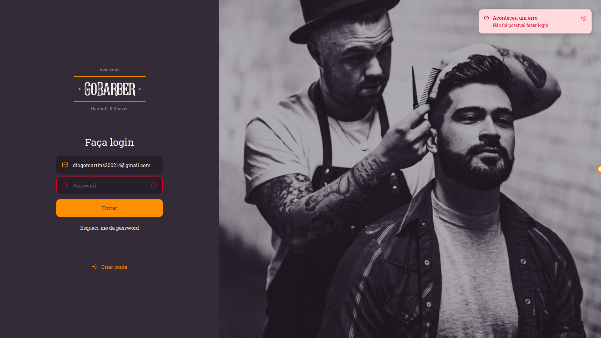
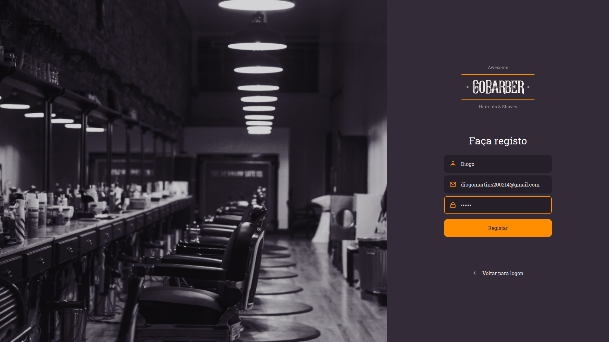

<h1 align="center">Projeto em desenvolvimento!</h1>

---

<h1 align="center">
    
</h1>

<h1 align="center">
    
</h1>

<h1 align="center">
    
</h1>

# Indice

- [Sobre](#-sobre)
- [Tecnologias Utilizadas](#-tecnologias-utilizadas)
- [Como baixar o projeto](#-como-baixar-o-projeto)

## 🔖&nbsp; Sobre

O projeto **GoBarber** foi criado com a intenção de praticar e aprender mais sobre as tecnologias utilizadas. Todo o projeto foi desenvolvido orientado, pela Rocketseat, durante o Bootcamp GoStack 11.0.

Até ao momento o projeto conta com pagina de login/registo e a respetiva validação, formulários, tooltips, contextos, local storage e mensagens toasts.

---

## 🚀 Tecnologias utilizadas

O projeto foi desenvolvido utilizando as seguintes tecnologias

- [React Native](https://reactnative.dev/)
- [TypeScript](https://www.typescriptlang.org/)
- [Unform](https://github.com/Rocketseat/unform)
- [Styled Components](https://styled-components.com/)
- [Yup](https://github.com/jquense/yup)
- [React Hooks](https://reactjs.org/docs/hooks-intro.html)


---

## 🗂 Como baixar o projeto

<h1 align="center"><p>🗂 Como baixar o projeto

```bash

    # Clonar o repositório

    $ git clone https://github.com/Xavi002/front-end-go-barber

    # Entrar no diretório
    $ cd front-end-go-barber

    # Instalar as dependências
    $ yarn install

    # Iniciar o projeto
    $ yarn start
```

---

Desenvolvido por Diogo Martins
